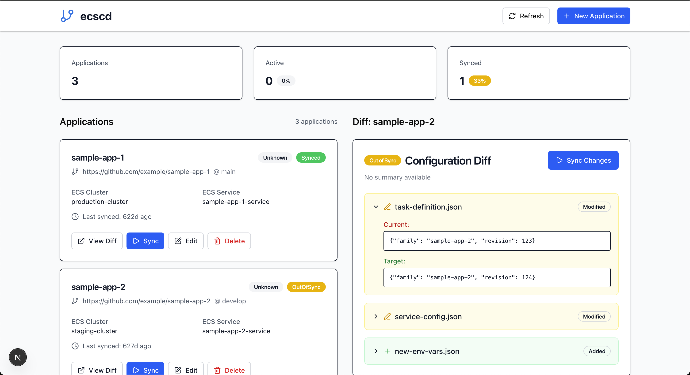

# ecscd

ECS Continuous Deployment - GitOps ベースの Amazon ECS デプロイメント管理ツール

## 概要

ececd は、GitHub リポジトリの ECS タスク定義を監視し、ECS サービスの自動デプロイメントを行う Web アプリケーションです。GitOps の原則に従い、宣言的な設定管理と継続的デプロイメントを実現します。

## 主な機能

- **GitOps ベースのデプロイメント**: GitHub リポジトリを信頼できる情報源として使用
- **ECS サービス管理**: タスク定義の変更を自動検出し、ECS サービスに反映
- **差分表示**: 現在の設定と目標設定の詳細な差分を可視化
- **リアルタイム監視**: デプロイメント状況をリアルタイムで追跡
- **Web UI**: 直感的な Web インターフェースによる管理
- **複数アプリケーション対応**: 複数の ECS サービスを一元管理

## 動作イメージ




## 技術スタック

- **Frontend**: Next.js 15, React 19, TypeScript, Tailwind CSS
- **Backend**: Next.js API Routes
- **Database**: SQLite (本番環境では DynamoDB 対応)
- **AWS**: ECS, STS (IAM ロール)
- **その他**: GitHub API, Lucide React Icons

## Docker イメージ

```bash
docker pull ghcr.io/dev-shimada/ecscd:latest
```

## 環境変数

| 変数名                | 説明                              | デフォルト値                    |
| --------------------- | --------------------------------- | ------------------------------- |
| `NODE_ENV`            | 実行環境                          | `production`                    |
| `DATABASE_TYPE`       | sqlite or dynamodb                | `sqlite`                        |
| `DYNAMODB_TABLE_NAME` | dynamodb table name               | `ECSCD`                         |
| `AWS_REGION`          | AWS リージョン                    | `us-east-1`                     |
| `SQLITE_DB_PATH`      | SQLite データベースファイルのパス | `/tmp/ecscd.db` or `./ecscd.db` |
| `GITHUB_TOKEN`        | GitHub Personal Access Token      | -                               |

## 起動方法

### Docker 使用

```bash
docker run -d \
  -p 3000:3000 \
  -e GITHUB_TOKEN=your_github_token \
  -e AWS_REGION=ap-northeast-1 \
  -v $(pwd)/data:/tmp \
  ghcr.io/dev-shimada/ecscd:latest
```

### ローカル開発

```bash
# 依存関係のインストール
cd ecscd
npm install

# 開発サーバーの起動
npm run dev
```

アプリケーションは `http://localhost:3000` でアクセスできます。

## アーキテクチャ

```
┌─────────────────┐    ┌─────────────────┐    ┌─────────────────┐
│   GitHub Repo   │    │     ecscd       │    │   Amazon ECS    │
│                 │    │                 │    │                 │
│ task-def.json   │───▶│  Web Interface  │───▶│  ECS Service    │
│                 │    │                 │    │                 │
└─────────────────┘    └─────────────────┘    └─────────────────┘
                              │
                              ▼
                       ┌─────────────────┐
                       │   Database      │
                       │ (SQLite/DDB)    │
                       └─────────────────┘
```

## ディレクトリ構成

```
ecscd/
├── src/
│   ├── app/                 # Next.js App Router
│   │   ├── api/            # API エンドポイント
│   │   └── globals.css     # グローバルスタイル
│   ├── components/         # Reactコンポーネント
│   │   ├── ui/            # UI基盤コンポーネント
│   │   └── *.tsx          # 機能別コンポーネント
│   └── lib/               # ビジネスロジック
│       ├── domain/        # ドメインモデル
│       ├── infrastructure/ # インフラストラクチャ層
│       ├── repository/    # データアクセス層
│       └── usecase/       # ユースケース層
├── Dockerfile
└── package.json
```

## 開発

### build

```bash
npm run build
```

### lint

```bash
npm run lint
```

### type check

```bash
npx tsc --noEmit
```
